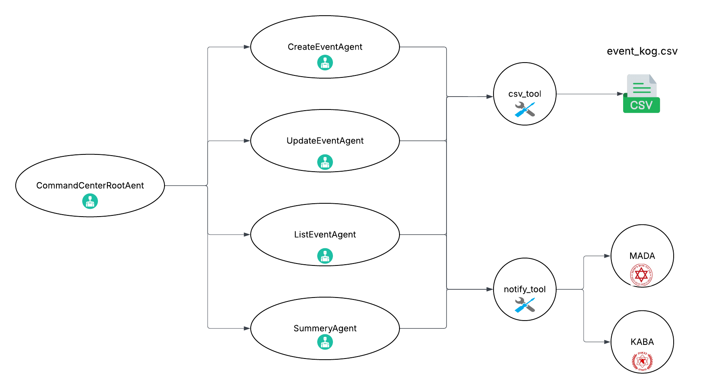

# 🛡️ Multi-Agent Emergency Command Center (ADK-based)

This project simulates a multi-agent operational command center designed to handle emergency events using Google’s Agent Development Kit (ADK). It mimics functionalities of a real command center (חמ״ל), allowing natural Hebrew communication for reporting, updating, and summarizing incidents.

---

## 📌 Use Case

The chatbot replaces traditional emergency operations systems by:

- Receiving new incident reports (e.g., fire, missile, earthquake) in free-form Hebrew
- Updating existing incidents by ID, name, or location
- Listing all current open incidents
- Generating command summaries in PDF format
- Triggering alerts to emergency services like MDA (מד״א) or Fire Department

---

## 🧠 Agents

| Agent Name               | Description                                                         |
| ------------------------ | ------------------------------------------------------------------- |
| `CommandCenterRootAgent` | Routes incoming Hebrew instructions to the correct sub-agent        |
| `CreateEventAgent`       | Creates a new event and appends it to a CSV. Triggers notifications |
| `UpdateEventAgent`       | Updates specific fields in an existing event                        |
| `ListEventsAgent`        | Lists all current open events in table format                       |
| `SummaryAgent`           | Generates a summary report and exports it as PDF                    |

---

## 🧰 Tools

| Tool Name         | Description                                                        |
| ----------------- | ------------------------------------------------------------------ |
| `csv_tool`        | Reads/writes structured event data from/to a CSV file              |
| `notify_tool`     | Sends alerts to MDA or Fire Department depending on context        |
| `pdf_export_tool` | Converts a formatted report to PDF and returns the saved file name |

---

## 🧱 Architecture

Suggested diagram structure:



---

## 📥 Input Examples

```text
יש שריפה עם 5 פצועים ליד מודיעין. צריך חילוץ.
```

```text
תעדכן את האירוע של השריפה ל־9 פצועים.
```

```text
תראה לי את כל האירועים הפתוחים.
```

```text
אני צריך דוח מסכם על כל האירועים.
```

---

## 📤 Output Examples

### 🆕 CreateEventAgent

```
אירוע חדש נרשם בהצלחה במערכת. מספר מזהה: 4632c70c-2068-4024-98f9-f72d7296494d
נשלחה הודעה למד"א
נשלחה הודעה לכיבוי והצלה
```

### 📋 ListEventsAgent

```
| מזהה אירוע | שם אירוע       | סוג אירוע | מצב   | פצועים | נ"צ     |
|------------|----------------|------------|--------|---------|--------|
| 1          | שריפה בגילה    | שריפה     | פתוח  | 5       |        |
```

### 📄 SummaryAgent (with PDF)

```
דוח סיכום חמ"ל
תאריך: 2025-06-04

סה"כ אירועים: 5
פתוחים: 4
סגורים: 1

נפגעים:
סה"כ פצועים: 32
סה"כ הרוגים: 8

אירועים לפי סוג:
רקטה: 2
שריפה: 2
רעידת אדמה: 1

הדוח נשמר בשם: hamal_report_20250604_143203.pdf
```

---

## 🧾 CSV Schema

The system uses a structured CSV file `events_log.csv` with the following fields:

```csv
event_id,event_name,event_description,event_type,injured,dead,rescue_required,status,location,event_time,urgency,area_type,damage_level
```

---

## 🔐 How to use Gemini with AI Studio (Token setup)

1. Go to [Google AI Studio](https://aistudio.google.com/app/apikey)
2. Click on **Create API Key**
3. Copy the key
4. Save it locally:

   ```bash
   export GOOGLE_API_KEY="your-api-key-here"
   ```

   You can also add this line to your `.bashrc`, `.zshrc`, or `.env` for persistence.

5. In Python or terminal:
   ```python
   import os
   os.getenv("GOOGLE_API_KEY")
   ```

---

## 🧪 Running Locally

```bash
adk web
```

Open Dev UI:

```
http://localhost:8000/dev-ui?app=CommandCenterRootAgent
```

---

## 📝 Design Considerations

- Language: All logic and user interaction is in Hebrew
- Agents are **stateless**, operating based on CSV as system memory
- Notifications are tools, not agents, to simplify execution
- PDF export enables official command-level reporting

---

<!-- ## 📸 Attachments

> ✅ Add here:
>
> - Screenshot of example PDF
> - Screenshot of Dev UI
> - Architecture diagram (PNG/SVG)

--- -->

## ✍️ Authors

- Developed by: **Ido Shterenberg**
- Stack: Python, Google ADK, FPDF
